# RF-Diffusion

We introduce RF-Diffusion, a versatile generative model designed for wireless data. RF-Diffusion is capable of generating various types of signals, including Wi-Fi, FMCW Radar, 5G, and even modalities beyond RF (e.g., EEG signal), showcasing RF-Diffusion's prowess across different signal categories. We extensively evaluate RF-Diffusion's generative capabilities and validate its effectiveness in multiple downstream tasks, including Wi-Fi sensing, 5G channel estimation, and EEG denoise.

Our basic implementation of RF-Diffusion is provided. We release several medium-sized pre-trained models (each containing 16 to 32 blocks, with 128 or 256 hidden dim) and part of the corresponding data files in [releases](https://github.com/mobicom24/RF-Diffusion/releases/tag/dataset_model) for performance testing. 

An intuitive comparison between RF-Diffusion and three other prevalent generative models is shown as follows. For demonstration purposes, we provide the **Doppler Frequency Shift (DFS)** spectrogram of the Wi-Fi signal, and the **Range Doppler Map (RDM)** spectrogram of the FMCW Radar signal, which are representative features of the two signals, respectively.
Please note that all these methods generate the **raw complex-valued signals**, and the spectrogram are shown for ease of illustration.


|     | Ground Truth  | RF-Diffusion  | DDPM[^DDPM]  | DCGAN[^DCGAN]  | CVAE[^CVAE]  | 
|  ----  | ----  | ----  | ----  | ----  | ----  | 
| **Wi-Fi**  |  | |  |  |   |
| **FMCW**   | 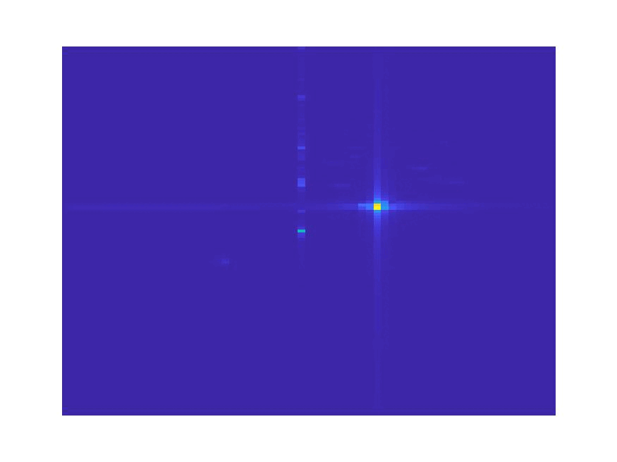 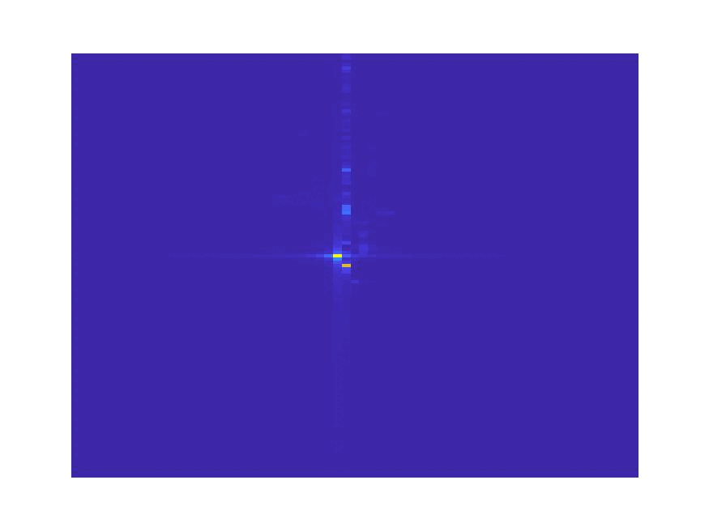 | 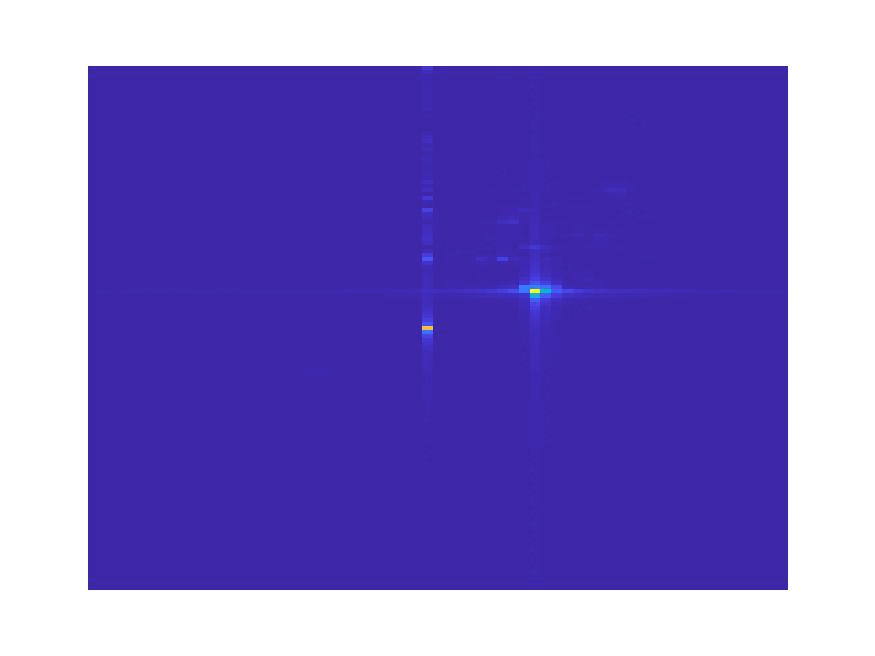 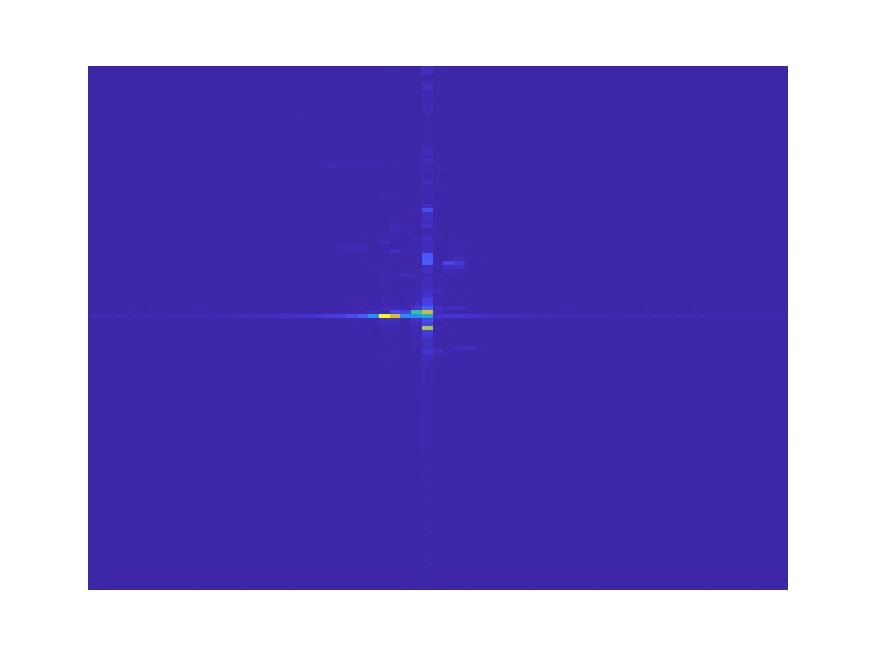 | 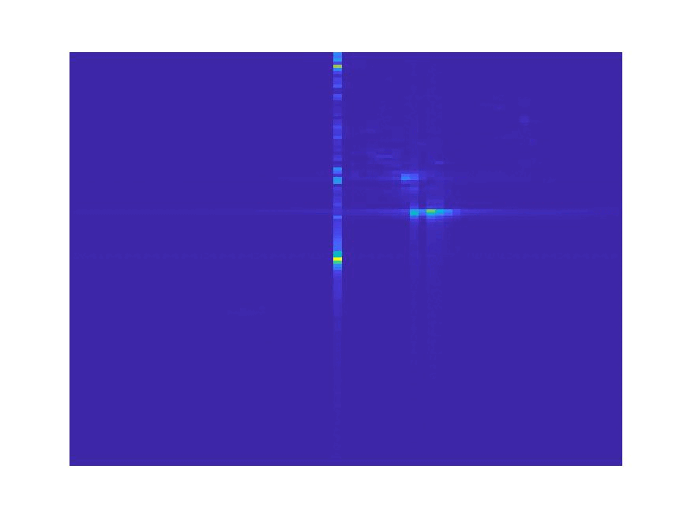 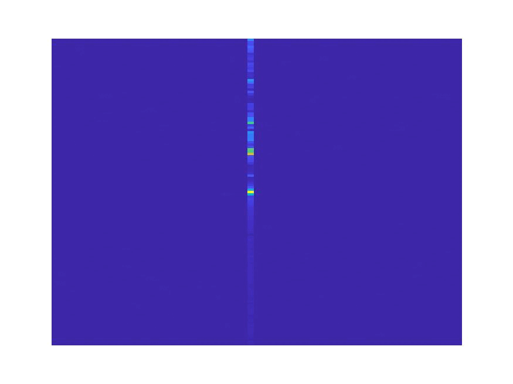 | 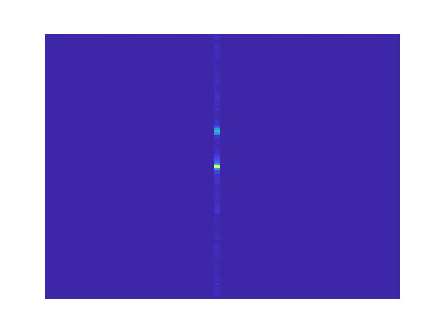 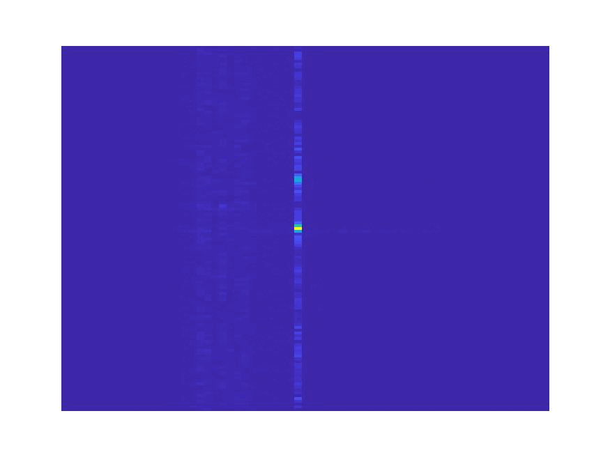 | 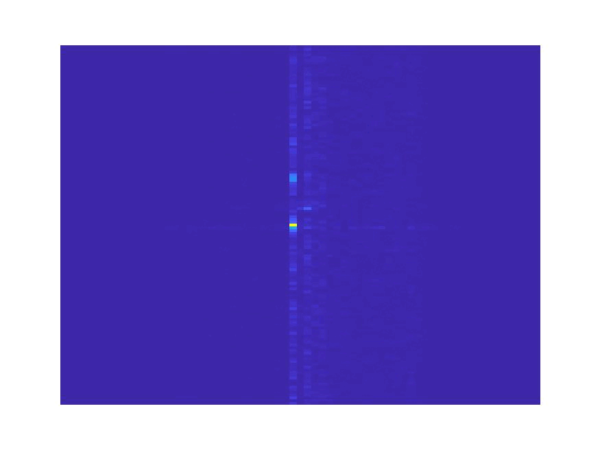 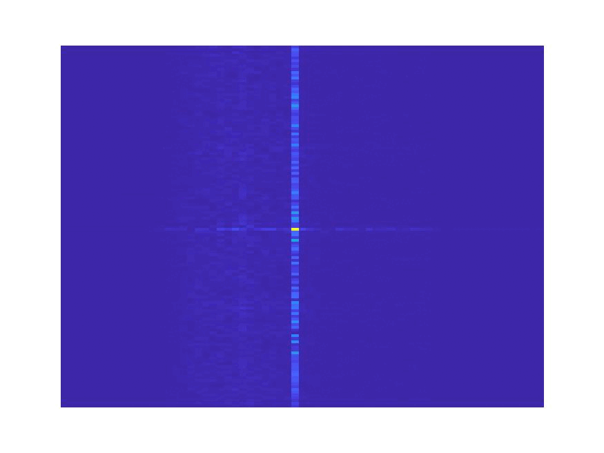 |


As seen, our proposed RF-Diffusion generates signals that retain physical features with high accuracy. 


## Table of Contents

- [RF-Diffusion](#rf-diffusion)
  - [Table of Contents](#table-of-contents)
  - [0. Prerequisite](#0-prerequisite)
  - [1. RF Data Generation](#1-rf-data-generation)
    - [1.1 Wi-Fi Data Generation](#11-wi-fi-data-generation)
    - [1.2 FMCW Data Generation](#12-fmcw-data-generation)
  - [2. Case Study](#2-case-study)
    - [2.1 Augmented Wireless Sensing](#21-augmented-wireless-sensing)
    - [2.2 5G FDD Channel Estimation](#22-5g-fdd-channel-estimation)
    - [2.3 Supplementary: EEG Signal Denoise](#23-supplementary-eeg-signal-denoise)


## 0. Prerequisite

RF-Diffusion is implemented with [Python 3.8](https://www.python.org/downloads/) and [PyTorch 2.0.1](https://pytorch.org/). We manage the development environment using [Conda](https://anaconda.org/anaconda/conda).
Perform the following commands to configure the development environment.

- Create a conda environment called `RF-Diffusion` based on python 3.8, and activate the environment.
    ```bash
    conda create -n RF-Diffusion python=3.8
    conda activate RF-Diffusion 
    ```

- Install PyTorch, as well as other required packages.
    ```bash
    pip3 install torch
    ```
    ```bash
    pip3 install numpy scipy tensorboard tqdm
    ```

For more details about the environment configuration, refer to the `requirement.txt` file in [releases](https://github.com/mobicom2445/RF-Diffusion/releases/tag/dataset_model).

Download or `git clone` the `RF-Diffusion` project. Download and unzip `dataset.zip` and `model.zip` in [releases](https://github.com/mobicom24/RF-Diffusion/releases/tag/dataset_model) to the project directory.

```bash
unzip dataset.zip -d [RF-Diffusion root directory]
unzip model.zip -d [RF-Diffusion root directory]
```

The project structure is shown as follows:

<div align="center">    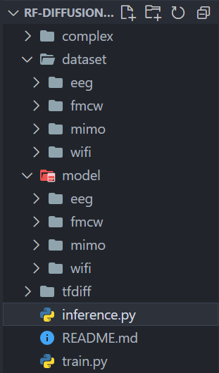 </div>

## 1. RF Data Generation

In the following part, we use `task_id` to differentiate between four types of tasks of synthesising Wi-Fi, FMCW signals, performing 5G channel estiamtion, and denoising the EEG to 0, 1, 2 and 3 respectively.

### 1.1 Wi-Fi Data Generation

By executing the following code, you can generate new Wi-Fi data, and the corresponding average SSIM (Structural Similarity Index Measure) will be displayed in the command line.

```python
python3 inference --task_id 0
```

The generated data are stored in `.mat` format, and can be found in `./dataset/wifi/output`.

Our model showcases the best performance in both SSIM (Structure Similarity Index Measure) and FID (Frechet Inception Distance) among all prevalent generative models:
<div align="center">     </div>

### 1.2 FMCW Data Generation

By executing the following code, you will generate FMCW data, and the corresponding average SSIM (Structural Similarity Index measure) will be displayed in the command line.

```python
python3 inference --task_id 1
```

The generated data are stored in `.mat` format, and can be found at `./dataset/fmcw/output`.

Our model showcases the best performance in both SSIM (Structure Similarity Index Measure) and FID (Frechet Inception Distance) among all prevalent generative models:
<div align="center">     </div>

## 2. Case Study

### 2.1 Augmented Wireless Sensing

A pre-trained RF-Diffusion can be leveraged as a data augmenter, which generates synthetic RF signals of the designated type. The synthetic samples are then mixed with the original dataset, collectively employed to train the wireless sensing model.
You can try performing the data generation task on your own dataset based on the instructions in [Data Generation](#1-data-generation), and train your own model with both real-world and synthetic data.

To retrain a new model, you only need to place your own data files within the `./dataset/wifi/raw` or `./dataset/fmcw/raw` directory, and then execute the `train.py` script to retrain. You may need to properly set the `./tiff/params.py` file to correspond to your input data format.

Taking Wi-Fi gesture recognition as an example. We choose the Widar3.0 dataset, and perform augmented wireless sensing on two models, Widar3.0 and EI, to test the performance gain of data augmentation in both cross-domain and in-domain scenarios.
<div align="center">     </div>

<div align="center">     </div>


### 2.2 5G FDD Channel Estimation

By executing the following command, a downlink channel estimation for 5G FDD system can be performed. 

```python
python3 inference --task_id 2
```

The corresponding average Signal-to-Noise Ratio (SNR) will be displayed in the command line.

The channel estimation is evaluated based on the [Argos](https://renew.rice.edu/dataset-argos.html) dataset with the following results, our model showcase the best performance compared with state-of-the-arts.

<div align="center">     </div>


### 2.3 Supplementary: EEG Signal Denoise

RF-Diffusion is capable of generating time-series data, and thus has potential benefits **beyond the wireless/RF signals**.
Additionally, we provide an supplementary case study for EEG denoising, which doesn't appear in our submitted paper due to the page limitation.

To run the EEG denoising application, you only need to extract the contents of `eeg.zip` and place the extracted folder in the `model` folder. 

```bash
unzip eeg.zip -d [RF-Diffusion/model]
```

By executing the following code, RF-Diffusion can be leveraged to denoise the EEG signals which is contaminated by EOG interference. 

```python
python3 inference --task_id 3
```

The corresponding average Signal-to-Noise Ratio (SNR) will be displayed in the command line. The denoised EEG data can be found at `./dataset/eeg/output`.

Our EEG denoising evaluation is tested on the [GCTNET](https://github.com/JinY97/GCTNet/tree/main/data) dataset. Compared with other denoising methods, RF-Diffusion demonstrate a delightful result.


<div align="center">     </div>


[^DDPM]: Ho J, Jain A, Abbeel P. Denoising diffusion probabilistic models[J]. Advances in neural information processing systems, 2020, 33: 6840-6851.
[^DCGAN]: Radford A, Metz L, Chintala S. Unsupervised representation learning with deep convolutional generative adversarial networks[J]. arXiv preprint arXiv:1511.06434, 2015.
[^CVAE]: Sohn K, Lee H, Yan X. Learning structured output representation using deep conditional generative models[J]. Advances in neural information processing systems, 2015, 28.